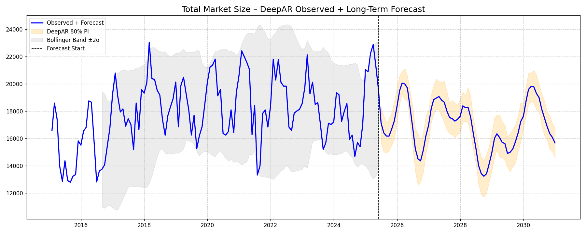
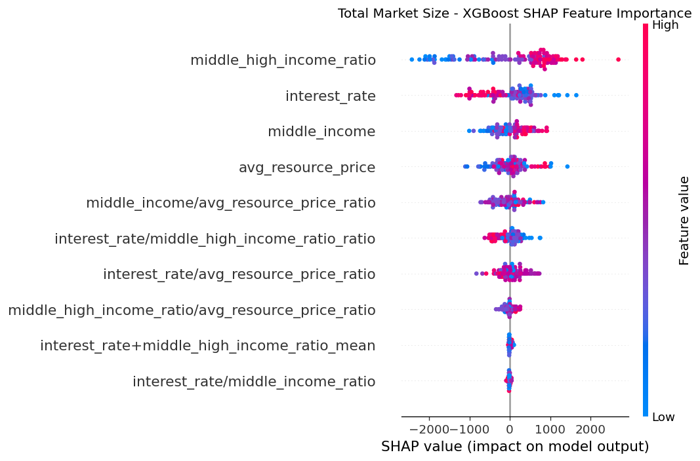

# Chile Vehicle Demand Forecast

A probabilistic demand-forecasting pipeline for the Chilean automotive market, combining a
**DeepAR** neural forecaster with **XGBoost** gradient boosting in an ensemble, driven by
macroeconomic covariates (income distribution, interest rates, commodity prices).

> **Data disclaimer:** This repo ships a synthetic dataset (`data/generate_synthetic_data.py`)
> that mimics the shape and relationships of the original real-world project — it is seeded
> random data, not actual sales or market figures from any company. This project reproduces
> the *methodology* from work I did professionally, rebuilt from scratch on public-style data
> for a portfolio-safe demo.

## Why this approach

Vehicle demand is driven by both **structural macro trends** (a growing middle/high-income
population buys more cars; higher interest rates suppress financed purchases; commodity
prices proxy for the health of Chile's export-driven economy) and **short-term momentum** in
the sales series itself. A single model struggles to capture both:

- **DeepAR** (`gluonts`, PyTorch-based) is an autoregressive RNN that learns a full predictive
  distribution per time series and naturally incorporates the macro features as dynamic
  real-valued covariates, extrapolated years into the future.
- **XGBoost** is trained on the same macro feature set as a purely feature-driven regressor,
  which tends to generalize better when the historical series itself is short or noisy.
- The **ensemble** is a per-segment weighted average of the two, with the weight set from
  each model's out-of-sample accuracy in a rolling-origin backtest (Section 4 of the
  [technical report](docs/REPORT.md)) rather than an arbitrary 50/50 split.

See **[docs/REPORT.md](docs/REPORT.md)** for the full write-up: method justification,
experimental design (hyperparameter search methodology, rolling-origin backtest, ensemble
weighting), results, and — importantly — a limitations section that states plainly which
assumptions this pipeline is making and where they'd break.

## Architecture

```
data/generate_synthetic_data.py   Synthetic macro + segment sales dataset (seeded, reproducible)
src/chile_forecast/
  config.py         Paths, date ranges, segment list, model hyperparameters
  features.py       Longest-valid-slice utility, time features, macro feature engineering
  metrics.py         MAE / RMSE / MAPE / R2 fit metrics
  deepar_model.py    Shared DeepAR trainer + holdout / long-term / rolling-window wrappers
  xgb_model.py       XGBoost training (holdout prediction + fitted-model access for SHAP)
  tuning.py          XGBoost time-series CV search; DeepAR validation-window grid search
  backtest.py        Rolling-origin (walk-forward) backtest across multiple time origins
  ensemble.py        Backtest-weighted DeepAR/XGBoost ensemble, holdout summary table
  interpret.py       SHAP feature-importance plots for the XGBoost leg of the ensemble
  visualize.py       Observed + forecast plot with Bollinger-band uncertainty context
  pipeline.py        Orchestrates the full run across every market segment
run_pipeline.py       CLI entry point
tests/                Unit tests for the pure utility functions
docs/REPORT.md        Technical report: methodology, results, limitations
```

Each of the ten market segments (total industry size, per-brand sales, body-style segments
like sedans/hatchbacks/SUVs) is modeled independently, since each has a different history
length and demand pattern — segments only get modeled once they clear a minimum history
length (`MIN_SERIES_LEN`), and the pipeline finds each segment's longest usable contiguous
history automatically (handling segments introduced partway through the dataset, e.g. newer
SUV categories).

## Methodology

1. **Feature engineering** — derive income-tier ratios, a z-scored commodity-price composite
   (see the report for why an unweighted mean was wrong here), and cross-ratios with interest
   rates as macro covariates.
2. **Hyperparameter search** — XGBoost via `RandomizedSearchCV` + `TimeSeriesSplit`; DeepAR via
   a small grid scored on a held-out validation window. Both run once on a representative
   segment and are reused everywhere (see report §4.1 for why).
3. **Rolling-origin backtest** — re-run the 3-month holdout at 3 successive origins per segment
   to get a MAE distribution instead of one point estimate, and to set each segment's
   DeepAR/XGBoost ensemble weight from actual out-of-sample accuracy.
4. **Final holdout** — train on all-but-the-last 3 months, predict the held-out months, compare
   MAE for DeepAR vs. XGBoost vs. the weighted ensemble.
5. **Long-term forecast** — retrain DeepAR on the full observed history and forecast out to a
   multi-year horizon, with 80% prediction intervals.
6. **Interpretability** — SHAP summary plot per segment for the XGBoost leg of the ensemble.
7. **Visualization** — observed + forecast series plotted alongside DeepAR's prediction
   interval and a rolling Bollinger Band (±2σ) on the observed data for additional volatility
   context.

## Getting started

```bash
python -m venv .venv
source .venv/bin/activate          # Windows: .venv\Scripts\activate
pip install -r requirements.txt

python data/generate_synthetic_data.py   # builds data/synthetic_chile_data.csv
python run_pipeline.py                   # tunes, backtests, trains, writes outputs/
pytest tests/                            # unit tests
```

Outputs (git-ignored, generated locally):
- `outputs/<segment>_forecast.png` — per-segment observed + forecast plot
- `outputs/<segment>_shap_summary.png` — per-segment XGBoost SHAP feature importance
- `outputs/holdout_deepar_xgb_ensemble_compare.xlsx` — final holdout comparison table
- `outputs/rolling_origin_backtest.xlsx` — per-origin backtest MAE for every segment
- `outputs/xgb_tuning_results.csv`, `outputs/deepar_tuning_results.csv` — search results

## Sample output




## Tech stack

Python, PyTorch, GluonTS (DeepAR), XGBoost, scikit-learn, pandas, matplotlib.
