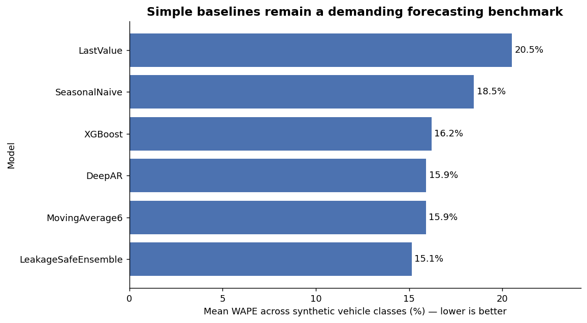

# Chile Vehicle Demand Forecast

[](https://github.com/kangi9401-pixel/chile-vehicle-demand-forecast/actions/workflows/ci.yml)

A leakage-safe monthly demand-forecasting pipeline for four synthetic Chilean vehicle
segments, plus a small linear-programming model that turns those forecasts into a
promotion-budget allocation under inventory, supply, factory, regulatory and strategic
constraints.

> **Data disclaimer:** every number in this repository — sales, macro indicators,
> inventory, margins, tariffs, promotion response — is seeded synthetic data generated by
> `data/generate_synthetic_data.py` and `src/chile_forecast/promotion_response.py`. It is
> not actual sales or market data from any company, and the promotion response is an
> assumed function, not an estimated causal effect.
>
> **Relationship to the original project:** the original internal model used a single
> DeepAR+XGBoost combination. Model comparison, the seasonal-naive baseline and
> rolling-origin backtesting were added in this independent rebuild on synthetic data.
> Population, income-tier and interest-rate inputs came from the original model; the
> commodity-price covariates were added in this rebuild.

## What the pipeline does

`python run_pipeline.py` runs, for each of the four segments **B-Sedan, B_HB, SUV-A and
SUV-B**:

1. **Rolling-origin backtest** — 8 common training cutoffs, 3 months apart
   (2022-08-31 … 2024-05-31). Each origin produces one 12-month forecast, which is scored
   on its first **3, 6 and 12 months**.
2. **Six models on identical cutoffs and target dates**
   - `LastValue` — repeat the last observation
   - `SeasonalNaive` — same month last year (the key baseline for monthly demand)
   - `MovingAverage6` — mean of the last six months
   - `XGBoost` — 150 trees on leakage-safe macro, calendar and trend features
   - `DeepAR` — small GluonTS model (24 hidden units, 2 layers, 2 epochs) with the same
     leakage-safe dynamic features
   - `LeakageSafeEnsemble` — DeepAR/XGBoost inverse-MAE weighted average whose weight at
     each origin uses only earlier origins' errors on dates observed by the current
     cutoff (50/50 at the first origin)
3. **Metrics** — MAE, RMSE, **WAPE** (headline metric), sMAPE and MASE.
4. **Promotion-budget optimization** — the latest forecasts feed five synthetic models'
   piecewise-linear, diminishing promotion response; `scipy.optimize.linprog` allocates a
   300 MCLP (million Chilean pesos) budget and is compared against equal,
   forecast-share and prior-year-share allocations, plus downside/base/upside scenarios.

### Leakage controls

`LeakageSafePreprocessor` (`preprocessing.py`) is re-fitted inside every origin:
imputation values and scaling statistics come from training rows only; unknown future
macro values (income, interest rate, commodity prices) are held at the last training
observation rather than read from the evaluation window; and a regression test checks
that corrupting future macro values leaves the training and forecast features unchanged.

## Results

All figures below are read from `outputs/decision_system/`, produced by
`python run_pipeline.py` (seed 42). Lower WAPE is better.

**Mean WAPE across the four segments (8 origins each)**

| Model | 3 months | 6 months | 12 months |
|---|---:|---:|---:|
| LeakageSafeEnsemble | **13.90%** | **14.63%** | **15.13%** |
| DeepAR | 14.70% | 15.29% | 15.91% |
| MovingAverage6 | 14.88% | 15.96% | 15.90% |
| XGBoost | 15.20% | 15.87% | 16.21% |
| SeasonalNaive | 18.38% | 18.46% | 18.47% |
| LastValue | 18.68% | 20.56% | 20.51% |

**12-month WAPE by segment**

| Segment | SeasonalNaive | XGBoost | DeepAR | Ensemble | Best |
|---|---:|---:|---:|---:|---|
| B-Sedan | 14.27% | **11.13%** | 14.66% | 12.21% | XGBoost |
| B_HB | 16.94% | 13.14% | 13.15% | **12.64%** | Ensemble |
| SUV-A | 17.08% | **15.85%** | 18.28% | 16.46% | XGBoost |
| SUV-B | 25.58% | 24.70% | **17.57%** | 19.22% | DeepAR |

**The ensemble was not always better; the best model differed by segment and horizon.**
Averaged over segments, the ensemble has the lowest WAPE at every horizon (18.1% below
Seasonal Naive at 12 months), and it is best in all four segments at 3 months. But at
6 months XGBoost is best for B-Sedan and DeepAR for SUV-B, and at 12 months a single
model wins three of the four segments. DeepAR is *worse* than Seasonal Naive at 12 months for B-Sedan
(14.66% vs 14.27%) and SUV-A (18.28% vs 17.08%). No single model dominates, so these
results do not support picking one "champion" model for every segment.



**Promotion-budget allocation (base scenario, synthetic response)**

| Strategy | Budget (MCLP) | Incremental units | Net incremental profit (MCLP) | All constraints met |
|---|---:|---:|---:|:---:|
| Equal | 300.00 | 71.50 | 138.27 | yes |
| Forecast share | 300.00 | 69.97 | 121.22 | yes |
| Prior-year share | 300.00 | 70.83 | 130.03 | yes |
| Optimized | **275.00** | 68.00 | **148.57** | yes |

The optimizer leaves 25 MCLP unspent: under the assumed margins, the remaining response
tiers (every model's third tier and the City Hatchback's second) return less
contribution than they cost. The result is 7.45% more net incremental profit than equal
allocation, with 3.5 fewer incremental units. This is a property of the assumed
response function, not evidence about real promotions.

See **[docs/REPORT.md](docs/REPORT.md)** for the full method, per-horizon tables, the
optimization formulation and limitations. A Korean version is in
[docs/REPORT_KO.md](docs/REPORT_KO.md), and the audit of this repository's earlier
3-origin / 3-month version is in [docs/AUDIT_KO.md](docs/AUDIT_KO.md).

## Limitations

- Synthetic data and an assumed promotion response: there is no external validity and no
  causal interpretation.
- ~100 monthly observations per segment is small for DeepAR; the 2-epoch setting is a
  structural comparison, not a tuned neural baseline.
- Future macro covariates are held flat at their last value.
- The 8 backtest windows overlap by 9 months, so their errors are not independent samples.
- The optimization uses three deterministic scenarios; no chance constraints or robust
  optimization.

## Getting started

macOS only: XGBoost needs OpenMP, which isn't bundled — `brew install libomp` first.

```bash
python -m venv .venv
source .venv/bin/activate          # Windows: .venv\Scripts\activate
pip install -r requirements.txt

python data/generate_synthetic_data.py   # rebuilds data/synthetic_chile_data.csv (seeded)
pytest tests/                            # unit, leakage and smoke tests
python run_pipeline.py                   # full backtest + optimization -> outputs/decision_system/
```

`python run_pipeline.py --skip-deepar` is a fast smoke-test mode; it omits DeepAR and the
ensemble, so it does not reproduce the results above.

Outputs in `outputs/decision_system/`: forecast predictions and per-origin / summary
metrics, improvement versus Seasonal Naive, promotion inputs and response tiers,
allocation detail and strategy comparison, constraint checks, scenarios, and seven
charts.

## Architecture

```
data/generate_synthetic_data.py   Seeded synthetic macro + segment sales dataset
src/chile_forecast/
  config.py                  Paths, segments, backtest design, seeds
  preprocessing.py           Per-origin fit/transform; flat future macro features
  baselines.py               LastValue / SeasonalNaive / MovingAverage6
  xgb_model.py               XGBoost training and prediction
  deepar_model.py            Seeded, deterministic DeepAR trainer
  evaluation.py              Common 8-origin, 3/6/12-month evaluation and ensemble
  metrics.py                 MAE / RMSE / WAPE / sMAPE / MASE
  promotion_response.py      Synthetic promotion inputs and diminishing response tiers
  optimization.py            Budget LP, heuristic strategies, constraint checks
  decision_visualization.py  Report charts
  pipeline.py                run(): the default pipeline
  legacy/                    Pre-audit 3-month workflow (run_legacy, hyperparameter
                             search, SHAP), kept only for audit traceability
run_pipeline.py              CLI entry point
tests/                       Unit, leakage-invariance, reproducibility and smoke tests
  legacy/                    Tests for the legacy workflow
docs/                        Technical report (EN/KO) and audit notes
.github/workflows/ci.yml     Data regeneration check, pytest and a pipeline smoke run
```

## Tech stack

Python, PyTorch, GluonTS (DeepAR), XGBoost, scikit-learn, SciPy, pandas, matplotlib.
