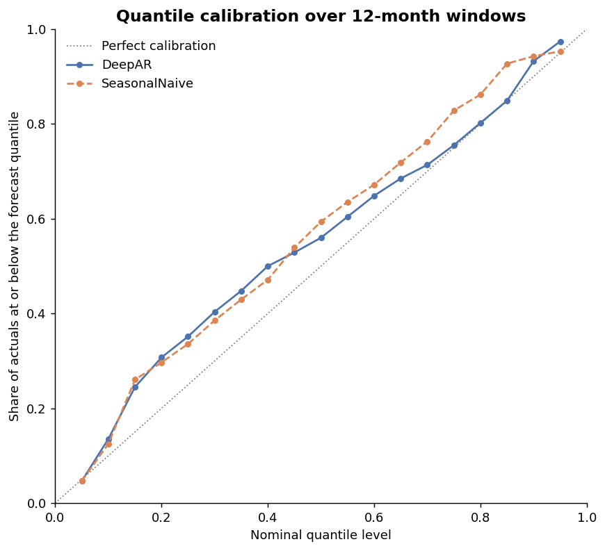
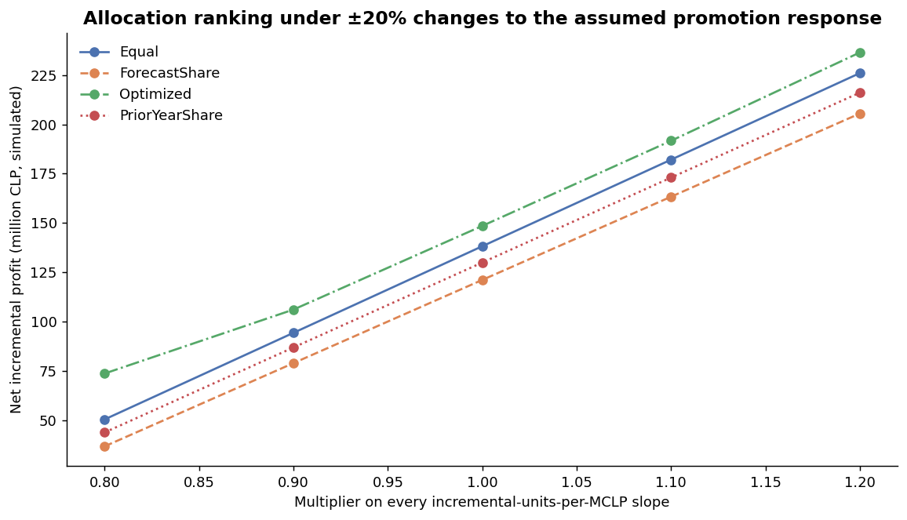

# Technical Report: Chile Vehicle Demand Forecasting

## 1. Problem Statement

Monthly new-vehicle demand in an export-driven economy like Chile mixes slow structural
drivers (income distribution, population), faster macro cycles (interest rates,
commodity prices) and strong seasonality. This project asks two questions:

1. Once preprocessing and model selection are free of look-ahead leakage, do DeepAR,
   XGBoost or their ensemble actually beat simple seasonal baselines, and how does that
   depend on the segment and the forecast horizon?
2. Given those forecasts, does a constraint-aware promotion-budget allocation produce
   more net incremental profit than allocation rules that follow demand alone?

**Data disclaimer:** all data is seeded synthetic data
(`data/generate_synthetic_data.py`, seed 42; promotion inputs in
`src/chile_forecast/promotion_response.py`). Every number here describes the *method* on
synthetic data, not the Chilean auto market or any company's results.

**Relationship to the original project:** the original internal model used a single
DeepAR+XGBoost combination. Model comparison, the seasonal-naive baseline and
rolling-origin backtesting were added in this independent rebuild on synthetic data.
Population, income-tier and interest-rate inputs came from the original model; the
commodity-price covariates were added in this rebuild.

## 2. Data

The generator produces 125 months (2015-01 to 2025-05) of population, low/middle/high
income counts, interest rate, crude oil / iron ore / copper prices and ten market and
segment sales series with seasonality, trend, macro effects and noise. The evaluation
uses the four body-style segments **B-Sedan, B_HB, SUV-A and SUV-B**. SUV-A and SUV-B
start with 24 and 36 missing months respectively, mimicking later product launches;
each series is evaluated on its observed span.

## 3. Method

### 3.1 Models

| Model | Description |
|---|---|
| `LastValue` | Repeats the last training observation |
| `SeasonalNaive` | Value from the same month one year earlier |
| `MovingAverage6` | Mean of the last six training months |
| `XGBoost` | 150 trees, seed 42, on leakage-safe macro, calendar (month sine/cosine) and trend features; no target lags |
| `DeepAR` | GluonTS/PyTorch, 24 hidden units, 2 layers, lr 1e-3, 2 epochs, with the same leakage-safe features as dynamic covariates |
| `LeakageSafeEnsemble` | `w·DeepAR + (1−w)·XGBoost`, `w = MAE_XGB / (MAE_DeepAR + MAE_XGB)` using earlier origins' errors on dates observed by the current cutoff only; `w = 0.5` at the first origin |

DeepAR is deliberately small: with roughly 100 monthly observations per series, extra
capacity adds runtime and overfitting risk rather than evidence. Python, NumPy and Torch
seeds are fixed at 42 and the Lightning trainer runs in deterministic mode; a test
checks that two DeepAR runs on the same input produce identical predictions.

### 3.2 Leakage-safe preprocessing

`LeakageSafePreprocessor` is fitted separately at every origin with training cutoff *t*:

- imputation medians and the mean/std used to z-score income, interest rate and each
  commodity price come only from rows with date ≤ *t*;
- evaluation rows are transformed with those training statistics;
- unknown future macro values are **not** read from the evaluation window — they are
  held at their last training value, and only calendar and trend features advance;
- ratio features that divided by a commodity z-score (which crosses zero and made the
  ratios explode) are not used.

`tests/test_decision_system.py::test_future_rows_cannot_change_training_preprocessing`
corrupts future macro values (copper ×1,000,000, interest rate −999) and asserts that
the training and forecast features do not change.

### 3.3 Backtest design

All models share **8 training cutoffs**, 3 months apart: 2022-08-31, 2022-11-30,
2023-02-28, 2023-05-31, 2023-08-31, 2023-11-30, 2024-02-29 and 2024-05-31. At each
cutoff every model makes one 12-month forecast, which is scored on its first **3, 6 and
12 months**, so every model sees exactly the same training data and target dates at
every horizon. This gives 4 segments × 8 origins × 3 horizons × 6 models = 576 metric
rows and 4,032 prediction rows (`forecast_metrics_by_origin.csv`,
`forecast_predictions.csv`).

### 3.4 Metrics

MAE, RMSE, **WAPE** (Σ|actual − forecast| / Σ|actual|, the headline metric), sMAPE, and
MASE scaled by the in-sample seasonal-naive error. Plain MAPE is not reported because it
is unstable near zero. Adjacent windows overlap by 9 months, so the spread across origins
describes variability; Section 3.6 describes how the significance tests account for the
overlap.

### 3.5 Probabilistic evaluation

DeepAR's 19 quantiles (5%, 10%, …, 95%) are taken from the same sample paths as its
mean, so the point forecasts are unchanged. The probabilistic baseline is Seasonal Naive
plus the empirical quantiles of its year-on-year errors within the training window.
`probabilistic.py` scores both, per origin and horizon:

- **80% coverage**: share of actuals inside the 10–90% interval (nominal 80%);
- **interval width** and the Gneiting–Raftery **interval score** (width plus a 2/α
  penalty for misses), both as a percentage of Σ|actual|;
- **scaled CRPS**: twice the mean pinball loss over the 19 levels, summed and divided by
  Σ|actual|. For a point forecast this equals WAPE, so the two are on the same scale;
- **calibration**: share of actuals at or below each quantile, pooled over segments and
  origins.

### 3.6 Significance tests

`significance.py` applies a two-sided Diebold–Mariano test to the per-origin WAPE
difference between two models, for each segment and for the segment average. An h-month
window overlaps the next ⌈h/3⌉ − 1 windows, so the variance uses a Newey–West (Bartlett)
estimator with lag 0, 1 and 3 at 3, 6 and 12 months. The statistic includes the
Harvey–Leybourne–Newbold correction and uses a Student-t reference with n − 1 = 7
degrees of freedom; at lag 0 it reduces to a one-sample t-test, which a unit test checks.
Within each scope and horizon, the six model pairs get a Holm adjustment.

## 4. Relationship to This Repository's Earlier Version

An earlier public version of this repository evaluated DeepAR, XGBoost and an
inverse-MAE ensemble on a single 3-month holdout plus 3 rolling origins, with MAE as the
only backtest metric and no baseline. An audit ([AUDIT_KO.md](AUDIT_KO.md)) found that
commodity prices were z-scored over the full 125 months before splitting, that
backtests used the evaluation window's actual macro values, and that ensemble weights
could include the origin being evaluated. Those earlier results are therefore not
comparable to the ones below and are not repeated here. A second audit found that,
because the 12-month windows overlap, an earlier origin's error still covered up to
nine months after the current cutoff; the weight now uses only errors on dates observed
by the cutoff, which raised the mean ensemble WAPE by 0.09–0.15 points. The numbers
below are after that fix. The earlier workflow remains
available as `chile_forecast.legacy.pipeline.run_legacy()` for traceability.

## 5. Forecast Results

All numbers are read from `outputs/decision_system/forecast_metrics_summary.csv` and
`forecast_improvement_vs_seasonal.csv`, produced by `python run_pipeline.py`.

### 5.1 Mean WAPE across segments

| Model | 3 months | 6 months | 12 months |
|---|---:|---:|---:|
| LeakageSafeEnsemble | **13.90%** | **14.63%** | **15.13%** |
| DeepAR | 14.70% | 15.29% | 15.91% |
| MovingAverage6 | 14.88% | 15.96% | 15.90% |
| XGBoost | 15.20% | 15.87% | 16.21% |
| SeasonalNaive | 18.38% | 18.46% | 18.47% |
| LastValue | 18.68% | 20.56% | 20.51% |

On the segment average, the ensemble's WAPE is 24.4%, 20.7% and 18.1% lower than
Seasonal Naive at 3, 6 and 12 months.

### 5.2 WAPE by segment and horizon

**3 months**

| Segment | LastValue | SeasonalNaive | MA6 | XGBoost | DeepAR | Ensemble |
|---|---:|---:|---:|---:|---:|---:|
| B-Sedan | 17.49 | 14.38 | 12.49 | 11.40 | 12.79 | **11.34** |
| B_HB | 17.06 | 16.04 | 12.65 | 13.14 | 11.99 | **11.85** |
| SUV-A | 15.84 | 16.61 | 15.48 | 14.59 | 14.30 | **14.03** |
| SUV-B | 24.32 | 26.48 | 18.91 | 21.68 | 19.73 | **18.37** |

**6 months**

| Segment | LastValue | SeasonalNaive | MA6 | XGBoost | DeepAR | Ensemble |
|---|---:|---:|---:|---:|---:|---:|
| B-Sedan | 19.40 | 15.31 | 14.24 | **11.60** | 13.79 | 12.05 |
| B_HB | 18.32 | 15.97 | 13.15 | 12.54 | 11.99 | **11.62** |
| SUV-A | 19.74 | 16.73 | 17.43 | 16.22 | 16.58 | **15.93** |
| SUV-B | 24.79 | 25.82 | 19.01 | 23.14 | **18.78** | 18.92 |

**12 months**

| Segment | LastValue | SeasonalNaive | MA6 | XGBoost | DeepAR | Ensemble |
|---|---:|---:|---:|---:|---:|---:|
| B-Sedan | 16.50 | 14.27 | 13.01 | **11.13** | 14.66 | 12.21 |
| B_HB | 18.41 | 16.94 | 14.03 | 13.14 | 13.15 | **12.64** |
| SUV-A | 20.94 | 17.08 | 17.00 | **15.85** | 18.28 | 16.46 |
| SUV-B | 26.20 | 25.58 | 19.56 | 24.70 | **17.57** | 19.22 |

**The ensemble was not always better, and the best model differed by segment and
horizon.** The ensemble is best in all four segments at 3 months, although only by
0.06 points over XGBoost for B-Sedan. At 6 months it is best for B_HB and SUV-A, while
XGBoost wins B-Sedan and DeepAR wins SUV-B. At 12 months it is best only for B_HB; XGBoost wins B-Sedan and SUV-A, and
DeepAR wins SUV-B. Relative to Seasonal Naive at 12 months, the best model improves
WAPE by 21.98% (B-Sedan), 25.42% (B_HB), 7.18% (SUV-A) and 31.33% (SUV-B). At the same
horizon, DeepAR is worse than Seasonal Naive for B-Sedan (14.66% vs 14.27%, −2.70%) and
SUV-A (18.28% vs 17.08%, −7.06%), and the ensemble is worse than XGBoost alone for those
two segments. On this data, a small neural model is not uniformly better than a
seasonal rule. An operational setup would need per-segment champion/challenger tracking
rather than one model for everything.


### 5.3 Feature importance (legacy workflow)

SHAP attribution is computed only in the legacy workflow
(`chile_forecast/legacy/`, `run_legacy()` and `interpret.py`). It uses that workflow's feature set, which still includes the
resource-price ratio features removed from the current pipeline, and it has not been
recomputed for the leakage-safe pipeline. For `Total Market Size`, it ranks
`middle_high_income_ratio` and `interest_rate` highest, followed by `middle_income` and
`avg_resource_price`. The engineered cross-ratios contribute comparatively little,
which is consistent with dropping the unstable ratio features. Treat this as a
qualitative check on the synthetic generator's built-in relationships, not as evidence
about real demand drivers.


### 5.4 Probabilistic forecasts

From `probabilistic_metrics_summary.csv` (means over segments; nominal coverage 80%):

| Model | Horizon | 80% coverage | Interval width | Interval score | Scaled CRPS | Point WAPE |
|---|---:|---:|---:|---:|---:|---:|
| DeepAR | 3 | 84.38% | 51.54 | 62.91 | **10.99** | 14.70 |
| DeepAR | 6 | 80.21% | 50.91 | 63.86 | **11.33** | 15.29 |
| DeepAR | 12 | 79.69% | 51.70 | 66.21 | **11.79** | 15.91 |
| SeasonalNaive | 3 | 81.25% | 61.90 | 78.17 | 13.70 | 18.38 |
| SeasonalNaive | 6 | 81.25% | 61.89 | 77.78 | 13.80 | 18.46 |
| SeasonalNaive | 12 | 82.03% | 60.90 | 76.97 | 13.68 | 18.47 |

12 months by segment:

| Segment | Coverage DeepAR | Coverage SN | CRPS DeepAR | CRPS SN |
|---|---:|---:|---:|---:|
| B-Sedan | 70.83% | 81.25% | 11.29 | **10.79** |
| B_HB | 82.29% | 85.42% | **10.02** | 12.35 |
| SUV-A | 82.29% | 82.29% | **13.01** | 13.26 |
| SUV-B | 83.33% | 79.17% | **12.84** | 18.34 |

On average, DeepAR's 80% interval covers close to its nominal rate (84.4%, 80.2% and
79.7% at 3, 6 and 12 months). It is about 9–11 points of volume narrower than the
Seasonal Naive interval and has a lower interval score and CRPS at every horizon. The
gap between DeepAR's CRPS and its point WAPE shows that the distribution carries
information beyond the mean.

The average hides two things. First, for B-Sedan DeepAR is over-confident: 12-month
coverage is 70.83% and its CRPS is worse than the baseline's, which matches its weak
point accuracy there. Second, for SUV-A DeepAR's CRPS is slightly better than the
baseline's even though its point WAPE is worse (Section 5.2). The pooled calibration
curve (`quantile_calibration.csv`) lies above the diagonal in the middle of the
distribution: 56% of actuals fall below DeepAR's median and 59% below Seasonal Naive's,
so both distributions sit slightly high.



### 5.5 Statistical significance

From `forecast_significance.csv`, segment average (negative difference favours model A):

| Horizon | Model A | Model B | Mean WAPE diff | DM stat | p | p (Holm) |
|---:|---|---|---:|---:|---:|---:|
| 3 | Ensemble | SeasonalNaive | −4.48 | −2.53 | 0.039 | 0.195 |
| 3 | DeepAR | SeasonalNaive | −3.67 | −2.73 | 0.029 | 0.177 |
| 3 | Ensemble | XGBoost | −1.31 | −1.76 | 0.122 | 0.489 |
| 6 | Ensemble | SeasonalNaive | −3.83 | −1.89 | 0.101 | 0.506 |
| 6 | DeepAR | SeasonalNaive | −3.17 | −2.17 | 0.067 | 0.400 |
| 6 | Ensemble | XGBoost | −1.25 | −1.71 | 0.132 | 0.527 |
| 12 | Ensemble | SeasonalNaive | −3.34 | −2.67 | 0.032 | 0.193 |
| 12 | DeepAR | SeasonalNaive | −2.56 | −2.36 | 0.051 | 0.254 |
| 12 | Ensemble | XGBoost | −1.07 | −1.83 | 0.110 | 0.441 |

The ensemble's average advantage over Seasonal Naive is nominally significant at 3 and
12 months (p ≈ 0.03–0.04), but not after adjusting for the six pairs tested at each
horizon (Holm p ≈ 0.19). Its advantage over XGBoost alone is not significant at any
horizon (p 0.11–0.13). Across all 90 segment × horizon × pair tests, 12 have an
unadjusted p below 0.05 and none have a Holm-adjusted p below 0.05 (smallest 0.143).
The accuracy ranking in Sections 5.1–5.2 is therefore a description of this backtest.
It is not statistical evidence that one model is better; with eight overlapping origins
per segment, the tests can detect only large, consistent differences.

## 6. Promotion-Budget Optimization

### 6.1 Formulation

Five synthetic models (City Hatchback, Compact Sedan, Compact SUV, Family SUV, and a
Legacy Diesel SUV that regulation forbids selling) receive the latest leakage-safe
forecast as base demand, plus inventory, supply, factory capacity, lifecycle, price,
tariff-adjusted cost, unit margin, strategic weight and min/max budget. Units are
million Chilean pesos (MCLP).

Each model's spend is split into three tiers of 35, 45 and 55 MCLP with declining
incremental units per MCLP. For example, the Compact SUV tiers are 0.34, 0.22 and 0.11
units/MCLP. These slopes are assumptions, not estimates. With spend `x_ij`, slope
`r_ij`, unit margin `m_i`, lifecycle bonus `a_i` (phase-out 0.45, mature 0.10, growth 0)
and strategic weight `w_i`, `scipy.optimize.linprog` (HiGHS) maximizes

```
Σ_ij x_ij · ( r_ij · (m_i + a_i) · w_i − 1 )
```

subject to: total budget ≤ 300 MCLP; per-model min/max budgets; base demand plus
incremental units ≤ inventory plus supply; per-factory production ≤ capacity; and zero
spend on the regulated model. The reported net incremental profit is the unweighted
`Σ r_ij·x_ij·m_i − Σ x_ij`, so strategic weights do not inflate the financial figure.
Equal, forecast-share and prior-year-share heuristics are evaluated under the same
bounds and constraint checks.

### 6.2 Results

From `allocation_strategy_comparison.csv` and `constraint_checks.csv`:

| Strategy | Budget (MCLP) | Incremental units | Net incremental profit (MCLP) | All constraints met |
|---|---:|---:|---:|:---:|
| Equal | 300.00 | 71.50 | 138.27 | yes |
| Forecast share | 300.00 | 69.97 | 121.22 | yes |
| Prior-year share | 300.00 | 70.83 | 130.03 | yes |
| Optimized | **275.00** | 68.00 | **148.57** | yes |

The optimizer spends 275 MCLP (City Hatchback 35, Compact Sedan 80, Compact SUV 80,
Family SUV 80, Legacy Diesel SUV 0) and leaves 25 MCLP unused, because the remaining
tiers return less contribution than they cost under the assumed margins. It produces
3.5 fewer incremental units than equal allocation, but 7.45%, 22.56% and 14.26% more net
incremental profit than the equal, forecast-share and prior-year-share rules. So
maximizing volume and maximizing profit give different allocations.

Demand scenarios scale base demand by 0.85 / 1.00 / 1.15, capped at 96% of inventory
plus supply (`scenario_summary.csv`). The downside and base scenarios have the same
optimum (275 MCLP, 148.57 MCLP profit). In the upside scenario, base demand uses more
factory capacity, so the optimal spend *falls* to 185.56 MCLP (51.36 incremental units,
125.29 MCLP profit). Stronger demand does not automatically justify more promotion when
supply binds.


### 6.3 Sensitivity to the assumed response

The tier slopes are the least grounded inputs, so `optimization_sensitivity.csv` re-runs
the base-scenario comparison with every slope multiplied by 0.8–1.2:

| Slope factor | Optimized budget | Optimized profit | Equal profit | Optimized vs Equal | Forecast share | Prior-year share |
|---:|---:|---:|---:|---:|---:|---:|
| 0.8 | 230.00 | 73.85 | 50.62 | +45.90% | 36.98 | 44.02 |
| 0.9 | 275.00 | 106.21 | 94.45 | +12.46% | 79.10 | 87.03 |
| 1.0 | 275.00 | 148.57 | 138.27 | +7.45% | 121.22 | 130.03 |
| 1.1 | 300.00 | 191.67 | 182.10 | +5.25% | 163.34 | 173.03 |
| 1.2 | 300.00 | 236.37 | 225.93 | +4.62% | 205.47 | 216.03 |

The ranking (optimized > equal > prior-year share > forecast share) holds at every
factor, and every allocation meets all constraints. The size of the advantage depends
heavily on the assumption. When response is weaker, the optimizer gains most by not
spending: at 0.8× it also drops the Compact Sedan's second tier and spends 230 MCLP.
When response is stronger, the City Hatchback's second tier becomes worthwhile, the
whole budget is spent, and the optimizer also delivers more incremental units than
equal allocation (80.30 vs 78.65 at 1.1×). Its advantage shrinks to about 5%.

Scaling one model at a time by 0.8× and 1.2× (`optimization_sensitivity_by_model.csv`)
moves the optimized profit the most for the Compact SUV (119.11 to 175.34 MCLP), whose
spend rises to 105 MCLP at 1.2×. Next come the Family SUV (123.19–173.95), Compact Sedan
(138.85–168.29) and City Hatchback (138.42–164.82). The Compact SUV's response
assumption is therefore the one most worth estimating first.



## 7. Limitations and Future Work

- **Synthetic data and an assumed response function.** The results show that the
  method works, but have no external validity. The optimum is only as good as the
  assumed tier slopes; real use would need experimental or quasi-experimental estimates
  of promotion response.
- **Flat future macro covariates.** Holding macro values at their last observation
  avoids leakage but is not a realistic path. A proper backtest would use
  forecast vintages that were available at each origin.
- **Small DeepAR.** About 100 observations per series and 2 epochs make this a
  structural comparison, not a statement about neural forecasters in general.
- **Overlapping windows and low power.** The 8 origins overlap, so errors are
  correlated across origins. The Diebold–Mariano tests account for this (Section 3.6),
  but with eight origins they can only detect large, consistent differences.
- **Simple probabilistic baseline.** The Seasonal Naive interval applies one in-sample
  error distribution to every lead, so it does not widen with horizon. A stronger
  probabilistic baseline (e.g. ETS or quantile regression) would make the comparison in
  Section 5.4 more demanding.
- **Deterministic scenarios.** Three point scenarios and a one-parameter sensitivity
  sweep (Section 6.3); no chance constraints, CVaR or distributionally robust
  optimization, and no forecast-value-added analysis of whether better accuracy changes
  the allocation.
- **Legacy SHAP.** Feature attribution (Section 5.3) was not recomputed for the
  leakage-safe feature set.
