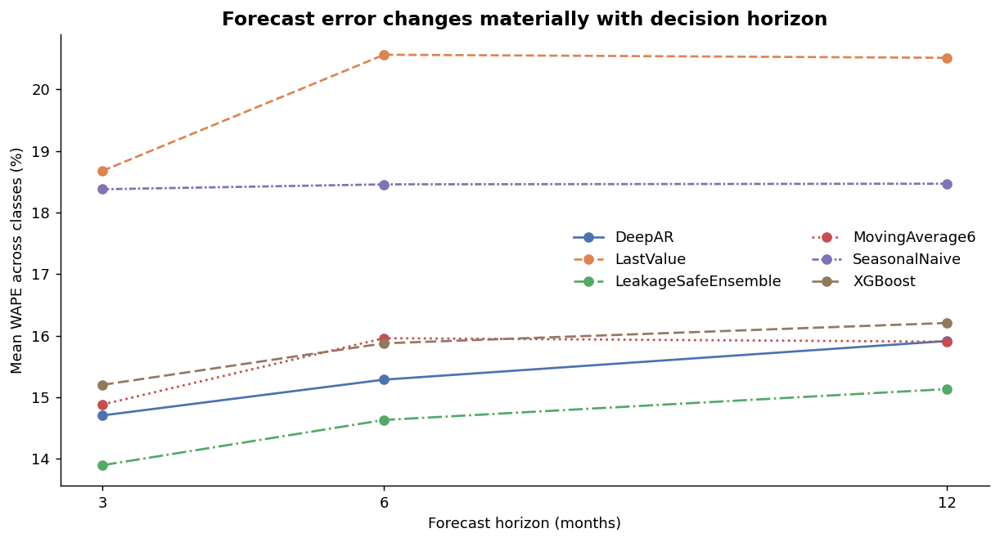
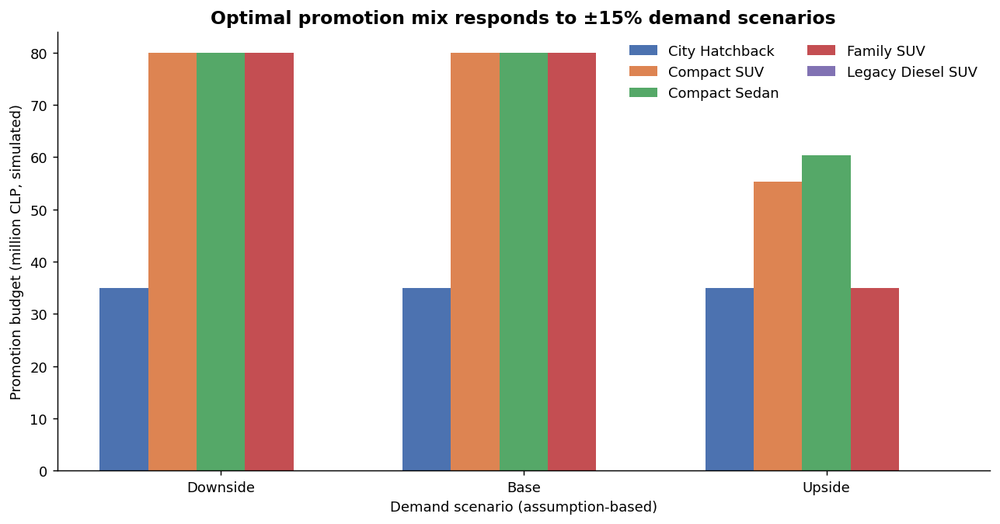

# 칠레 자동차 수요예측과 판촉예산 최적화: 누출 없는 예측에서 제약 기반 의사결정까지

## 초록

본 프로젝트는 칠레 자동차 시장을 모사한 월별 합성 데이터로 수요를 예측하고, 예측값을 차종별 판촉예산 배분 문제에 연결하는 방법론을 구현한다. 연구 질문은 “제한된 판촉예산과 재고·공급·공장·상품주기·규제·전략 제약 아래에서 어떤 차종에 얼마를 배분해야 판촉비 차감 후 기대 증분이익을 높일 수 있는가?”이다. 기존 구현을 감사한 결과, 전체 기간의 평균과 표준편차로 원자재 변수를 표준화해 미래 정보가 훈련 특징에 포함됐고, 0을 통과하는 표준화 값을 분모로 사용한 비율이 수치적으로 불안정했다. 또한 실제 예측시점에 알 수 없는 평가기간 거시변수를 사용하고, 3개 기준시점의 3개월 MAE만으로 복잡모형을 평가했다.

이를 수정하기 위해 매 rolling-origin의 훈련기간에서만 전처리 통계를 적합하고, 미래 거시변수는 마지막 관측값으로 고정했다. 4개 차급을 8개 기준시점에서 3·6·12개월 동안 Last Value, Seasonal Naive, 6개월 이동평균, XGBoost, DeepAR, 과거 오차만 사용하는 앙상블로 비교했다. 12개월 평균 WAPE는 앙상블 14.98%, DeepAR 15.91%, XGBoost 16.21%, Seasonal Naive 18.47%였다. 다만 차급별 최선 모형은 서로 달랐고 일부 차급의 DeepAR는 Seasonal Naive보다 나빴다.

다음으로 5개 합성 차종의 체감 판촉 반응을 구간별 선형함수로 표현하고 SciPy 선형계획으로 예산을 배분했다. 기준 시나리오에서 최적화는 300백만 CLP 한도 중 275백만 CLP를 사용해 순증분이익 148.57백만 CLP를 만들었다. 이는 균등배분보다 7.45% 높았다. 모든 수치는 가정 기반 시뮬레이션이며 실제 판촉의 인과효과나 회사 성과를 의미하지 않는다.

## 1. 문제 정의와 프로젝트 배경

자동차 해외영업의 계획 문제에는 두 종류의 불확실성이 동시에 존재한다. 첫째, 금리·소득·원자재 경기·계절성·제품 추세가 결합된 미래 수요를 정확히 알 수 없다. 둘째, 수요가 있더라도 재고, 선적, 공장 생산, 인증과 규제, 상품연도 전환, 차종별 공헌이익에 따라 실제로 판매 가능한 물량과 적정 판촉수준이 달라진다. 예측 정확도만 높이는 프로젝트는 두 번째 문제에 답하지 못한다.

원래의 사내 모델은 DeepAR+XGBoost 단일 조합이었다. 모형 비교, Seasonal Naive 기준모형, rolling-origin 백테스트, 거시 공변량은 합성 데이터 기반의 이 독립 재구현에서 추가한 것이다. 실제 회사 데이터나 내부 정책을 재현하지 않고, 공개 가능한 알고리즘과 합성 입력만으로 “예측 → 제약검증 → 배분 → 시나리오 비교”의 논리적 연결을 보여주는 것이 목적이다.

연구 질문은 세 가지다.

1. 미래 정보가 전처리와 모형선택에 섞이지 않은 상태에서 복잡모형이 계절 기준모형보다 우수한가?
2. 예측오차는 차급과 예측기간에 따라 어떻게 달라지는가?
3. 예측수요만을 따라 예산을 배분하는 방법보다 수익성과 운영제약을 함께 고려한 최적화가 더 높은 순증분이익을 만드는가?

## 2. 데이터와 보안 원칙

수요예측 데이터는 2015년 1월부터 2025년 5월까지 125개월이다. 인구, 저·중·고소득계층, 금리, 원유·철광석·구리가격과 10개 시장/차급 판매량을 난수 seed 42로 생성한다. 판매량에는 계절성, 소득구조, 금리, 원자재 경기, 차급별 성장·쇠퇴 추세와 잡음을 주입했다. SUV-A는 최초 24개월, SUV-B는 최초 36개월을 결측으로 설정해 출시시점 차이를 모사했다. 최종 비교에는 B-Sedan, B_HB, SUV-A, SUV-B를 사용한다.

판촉 최적화 입력도 합성이다. City Hatchback, Compact Sedan, Compact SUV, Family SUV, 규제로 판매할 수 없는 Legacy Diesel SUV를 정의했다. 입력에는 예측 기본수요, ±15% 예측 시나리오, 재고, 추가 공급, 공장, 상품주기, 판매가격, 관세 전 원가, 관세율, 변동비, 관세 반영 단위공헌이익, 전략가중치, 예산 하한·상한, 전년 판매량이 포함된다. 금액 단위는 백만 칠레 페소(MCLP)다.

이 자료는 어떤 실제 기업·딜러·공장의 수치도 아니다. 특히 판촉비와 추가판매량의 관계는 관측자료로 추정하지 않았으므로 인과효과라는 표현을 사용하지 않는다.

## 3. 저장소 이전 버전의 한계와 감사 결과

이 저장소의 이전 공개 버전은 DeepAR와 XGBoost, 역-MAE 앙상블, tuning, 3개 rolling origin, SHAP을 포함하고 기존 테스트 21개가 통과했다. 그러나 데이터 흐름을 추적하면 다음 문제가 있었다.

첫째, 세 원자재 가격을 전체 125개월의 평균과 표준편차로 z-score한 뒤 훈련·평가를 나눴다. 과거 행의 특징이 직접 미래값을 포함하지 않더라도, 그 특징을 정의하는 중심과 척도가 미래 관측에 의존하므로 시간 누출이다. 둘째, 평균 원자재 z-score는 0을 통과하는데 이를 분모로 사용한 다섯 개 비율 특징이 있었다. 0 부근에서 값이 폭발한 뒤 무한대를 0으로 바꾸면 정보가 왜곡된다. 셋째, historical backtest에서 평가기간의 실제 거시값을 동적 설명변수로 사용했다. 결과를 나중에 분석하는 데는 존재하지만 실제 예측 발생시점에는 알 수 없는 값이므로, 운영상 공정한 비교가 아니다.

넷째, 3개월 × 3개 origin의 MAE만으로는 계절 기준모형과 복잡모형의 장기 차이를 판단하기 어렵다. Last Value와 전년 동월 Seasonal Naive가 없어 “좋은 MAE”가 단순 규칙보다 실제로 나은지 알 수 없었다. 다섯째, 앙상블 가중치가 segment 전체 rolling 결과로 계산되어 현재 평가시점 이후 origin이 현재 가중치에 들어갈 여지가 있었다. 마지막으로 README와 기존 기술보고서는 3개월 평가를 핵심 결과로 기술해 새 완료기준과 맞지 않았다.

## 4. 데이터 누출 수정

새 `LeakageSafePreprocessor`는 학습을 명시적으로 분리한다. origin의 훈련종료일을 (t)라고 할 때 중앙값, 평균, 표준편차는 오직 (s \le t)인 행으로 계산한다. 평가행 (s>t)에는 이 통계량만 적용한다. 중간소득, 금리, 중·고소득 인구비율, 세 원자재의 개별 z-score와 그 평균을 생성하고, 월의 sine/cosine과 결정론적 추세를 추가한다. 평균 원자재 z-score를 분모로 쓰던 변수는 제거했다.

미래 설명변수 정책도 보수적으로 정했다. 평가기간의 날짜에서 월 주기와 추세만 진행시키고, 소득·금리·원자재 등 알 수 없는 값은 (t)의 마지막 관측값으로 고정한다. 이 가정은 정확한 거시전망이 있다는 가정보다 성능이 낮을 수 있지만, 미래정보를 무료로 사용하는 것보다 재현 가능하고 정직하다.

앙상블 가중치 역시 시간 순서를 지킨다. origin (k)의 DeepAR 가중치는 origin (1,…,k-1)의 12개월 MAE만으로 계산한다. 첫 origin은 정보가 없으므로 0.5를 사용한다. 최신 3개월 예측을 판촉 입력으로 넘길 때 선택하는 차급별 모형도 최신 origin을 제외한 앞선 7개 origin의 WAPE만 사용한다.

누출 회귀테스트는 평가기간의 구리가격을 백만 배하고 금리를 -999로 바꾼 두 데이터셋에서 훈련 특징과 미래 특징이 완전히 동일함을 확인한다.

## 5. 기준모형과 머신러닝 모형

Last Value는 최근 수준이 유지된다는 최소 기준이다. Seasonal Naive는 예측월의 전년 동월을 사용하며, 월별 자동차 수요에서 반드시 넘어야 하는 핵심 기준이다. 6개월 이동평균은 최근 수준의 잡음을 완화한 기준이다.

XGBoost는 누출 없이 처리한 거시·달력·추세 특징으로 학습한다. tree 150개, 단일 worker, seed 42를 사용했다. 모형은 미래 목표값이나 target lag를 직접 쓰지 않는다. 따라서 성능은 안전한 거시·계절·추세 특징이 만드는 차이를 나타낸다.

DeepAR는 과거 판매 시계열과 같은 누출방지 동적 특징을 입력으로 사용한다. 표본이 약 100개월에 불과하므로 hidden size 24, 2 layers, 2 epochs의 소형 설정을 사용했다. 이는 대규모 hyperparameter search를 통해 높은 숫자를 만드는 설계가 아니라, 작은 자료에서 신경망이 단순모형보다 안정적으로 나은지 확인하는 비교다. Python, NumPy, Torch seed를 42로 통일하고 deterministic trainer를 설정했다. 같은 입력을 두 번 학습한 DeepAR 예측은 배열 수준에서 완전히 같았다.

## 6. 백테스트 설계와 평가지표

모든 모형은 8개 공통 훈련종료일을 사용한다. 종료일은 2022-08-31부터 2024-05-31까지 3개월 간격이며, 각 종료일 다음 12개월의 실제 합성 판매를 보관한다. 각 origin에서 한 번 만든 12개월 예측의 앞 3, 6, 12개월을 평가하므로 horizon별 모형과 데이터 가용성은 정확히 같다. 4개 차급 × 8 origin × 3 horizon × 6 model로 576개 성능행과 4,032개 예측행을 생성했다.

지표는 다음과 같다.

- MAE: 단위가 판매대수라 현업 해석이 쉽다.
- RMSE: 큰 오차에 더 큰 가중을 둔다.
- WAPE: ∑|실제−예측| / ∑|실제|로, 개별 0 판매월에 안정적이다.
- sMAPE: 실제와 예측의 절대합을 분모로 사용한다.
- MASE: 훈련기간의 전년 동월 naive 오차를 척도로 사용한다.

일반 MAPE는 하위호환 함수에 남겨두었지만 핵심 결과표에는 사용하지 않는다. 8개 창은 서로 9개월 겹치므로 성능의 표준편차를 볼 수는 있지만 독립표본을 전제로 한 유의성 검정에는 적합하지 않다.

## 7. 수요예측 결과

### 7.1 전체 평균

| 모형 | 3개월 WAPE | 6개월 WAPE | 12개월 WAPE |
|---|---:|---:|---:|
| LeakageSafeEnsemble | **13.80** | **14.48** | **14.98** |
| DeepAR | 14.70 | 15.29 | 15.91 |
| MovingAverage6 | 14.88 | 15.96 | 15.90 |
| XGBoost | 15.20 | 15.87 | 16.21 |
| SeasonalNaive | 18.38 | 18.46 | 18.47 |
| LastValue | 18.68 | 20.56 | 20.51 |

12개월 평균에서 앙상블의 WAPE는 Seasonal Naive보다 18.9% 낮다. 3개월과 6개월에서도 앙상블이 평균 1위다. 다만 평균 순위만으로 단일 운영모형을 정하는 것은 위험하다.

### 7.2 차급별 이질성과 실패구간

12개월 기준 최선 모형은 B-Sedan에서 XGBoost 11.13%, B_HB에서 앙상블 12.59%, SUV-A에서 XGBoost 15.85%, SUV-B에서 DeepAR 17.57%다. Seasonal Naive 대비 개선율은 각각 21.98%, 25.68%, 7.18%, 31.33%다.

반대로 B-Sedan의 DeepAR는 14.66%로 Seasonal Naive 14.27%보다 2.70% 나빴고, SUV-A DeepAR는 18.28%로 Seasonal Naive 17.08%보다 7.06% 나빴다. Last Value는 네 차급 모두 또는 대부분에서 약했다. 이 결과는 작은 표본에서 DeepAR 용량이나 학습시간을 늘린다고 일반화가 자동으로 좋아지지 않으며, segment별 오류구조가 다름을 보여준다. 앙상블도 B-Sedan과 SUV-A에서 XGBoost 단독보다 나빴다. 따라서 실제 운영에서는 차급별 champion-challenger 관리와 지속적인 origin 추가가 필요하다.

## 8. 판촉 반응과 최적화 모형

### 8.1 반응함수

실제 딜러 인센티브 자료가 없으므로 각 차종의 판촉비를 폭 35, 45, 55 MCLP의 세 구간으로 나눈다. 첫 구간의 추가판매/MCLP가 가장 크고 다음 구간으로 갈수록 기울기가 낮아진다. 예를 들어 Compact SUV의 가정 기울기는 0.34, 0.22, 0.11대/MCLP다. 이 수치는 실증 추정값이 아니라 체감효과를 설명하기 위한 설정이다.

차종 (i), 구간 (j)의 예산을 (x_{ij}), 추가판매 기울기를 (r_{ij}), 관세 반영 단위공헌이익을 (m_i), 전략가중치를 (w_i), 상품주기 보너스를 (a_i)라 하면 목적함수는 다음과 같다.

\[
\max \sum_{i,j} x_{ij}\{r_{ij}(m_i+a_i)w_i-1\}
\]

보고되는 순증분이익은 전략가중 전 값인 \(\sum r_{ij}x_{ij}m_i-\sum x_{ij}\)이다. 목적함수와 재무 보고값을 분리해 전략 우선순위가 회계상 이익으로 오인되지 않게 했다.

### 8.2 제약조건

- 전체 예산은 300 MCLP 이하
- 모든 구간예산과 차종예산은 0 이상
- 차종별 최소·최대 예산
- 기준수요+추가판매는 재고+공급 이하
- 같은 공장의 필요 생산량 합계는 공장한도 이하
- 규제상 판매 불가 차종의 예산은 0
- Compact Sedan, Compact SUV, Family SUV의 전략 최소예산
- phase-out 차종의 재고소진가치를 목적함수에 반영

비교전략은 균등배분, 최신 누출방지 예측수요 비중, 합성 전년판매 비중, 최적화다. 휴리스틱도 같은 최소·최대·규제·공급·공장 조건 아래 평가한다.

## 9. 최적화와 시나리오 결과

| 전략 | 예산 | 추가판매 | 예상매출 | 총공헌이익 | 순증분이익 |
|---|---:|---:|---:|---:|---:|
| 균등 | 300.00 | 71.50 | 324,638.25 | 106,381.62 | 138.27 |
| 예측수요 비중 | 300.00 | 69.99 | 324,580.92 | 106,364.63 | 121.28 |
| 전년판매 비중 | 300.00 | 70.83 | 324,610.16 | 106,373.37 | 130.03 |
| 최적화 | **275.00** | 68.00 | 324,598.25 | **106,391.92** | **148.57** |

최적화는 균등배분보다 판매량이 3.5대 적지만 예산을 25 MCLP 덜 사용한다. 그 결과 순증분이익은 균등보다 7.45%, 예측수요 비중보다 22.5%, 전년판매 비중보다 14.26% 높다. 판매량 극대화와 이익 극대화가 다르다는 점이 이 모듈의 핵심이다. 규제 차종 배분은 0이고 모든 전략의 모든 제약검사가 참이다.

수요 시나리오는 기준수요에 -15%, 0%, +15%를 적용하되 재고·공급의 96%를 상한으로 둔다. 하방과 기준에서는 최적 예산이 275 MCLP, 순증분이익이 148.57 MCLP로 같다. 수요가 낮아도 판촉의 가정상 양의 한계이익과 충분한 공급여유가 유지되기 때문이다. 상방에서는 기준수요가 공장한도를 더 사용해 판촉예산이 184.11 MCLP, 추가판매 51.04대, 순증분이익 124.59 MCLP로 낮아진다. 이는 수요가 좋을수록 판촉비가 반드시 늘어나는 것이 아니라 공급제약 때문에 최적 판촉이 줄 수 있음을 보여준다.

## 10. 소프트웨어 구조와 검증

전처리, 기준모형, 평가, 판촉반응, 최적화, 시각화, 파이프라인을 모듈로 분리했다. `python run_pipeline.py` 한 명령이 4,032개 예측, 576개 origin별 성능, 72개 집계성능, 기준 대비 개선율, 판촉입력, 반응함수, 전략별 상세·요약, 제약검사, 시나리오, 그래프 7개를 `outputs/decision_system/`에 만든다.

새 테스트는 다음을 검증한다.

1. 미래값 변경이 훈련 전처리에 영향을 주지 않음
2. Seasonal Naive가 정확히 전년 동월을 반환
3. 모든 모형의 origin과 horizon이 동일
4. 예측행 수, lead, 날짜, 실제값이 정렬
5. 0 실제값을 포함한 WAPE와 sMAPE
6. 8개 공통 origin이 정확히 3개월 간격
7. 예산·차종한도·재고공급·공장·규제 제약
8. XGBoost와 DeepAR 시드 재현성
9. 합성 데이터 전체 smoke pipeline

## 11. 한계와 후속 연구

첫째, 합성 데이터는 방법의 작동을 검증하지만 칠레 실제 시장에 대한 외적 타당성을 제공하지 않는다. 둘째, 판촉 반응은 정해진 함수이므로 최적화 결과는 그 가정에 민감하다. 실제 적용에는 무작위 실험, 지역/딜러별 차분의 차분, 도구변수 등 식별전략이 필요하며 선택편향과 동시성을 다뤄야 한다.

셋째, 미래 거시변수의 마지막 값 고정은 누출 방지에는 안전하지만 현실적인 경기경로가 아니다. 실제 예측에서는 전망 vintage를 보존해 “당시 이용 가능했던 정보”로 backtest해야 한다. 넷째, DeepAR 자료량과 학습설정이 작아 신경망의 잠재력을 일반적으로 평가할 수 없다. 계층적 모델과 probabilistic calibration을 별도로 검증할 필요가 있다.

다섯째, 현재 시나리오는 세 개의 결정론적 점이다. 후속 연구에서는 예측분포와 판촉반응 불확실성을 함께 표본화하고 chance constraint, distributionally robust optimization, CVaR 목적함수를 비교할 수 있다. 마지막으로 forecast accuracy 개선이 실제 예산 의사결정가치로 이어지는지 forecast-value-added와 value-of-information 관점에서 검증해야 한다.

## 12. 결론

이 프로젝트의 가장 중요한 결과는 특정 모형의 높은 숫자가 아니다. 전체 기간 표준화와 미래 거시변수 사용을 제거하자 복잡모형의 우위는 차급별로 달라졌고, 기준모형보다 낮은 구간도 명확히 나타났다. 동시에 예측수요만 따라 예산을 배분하는 것이 이익 최적화가 아니며, 수익성과 운영제약을 명시하면 예산을 모두 쓰지 않는 해가 더 합리적일 수 있음을 보였다. 누출 없는 검증, 실패구간 공개, 가정과 실증의 구분, 자동 제약검사가 본 포트폴리오의 핵심 기여다.
